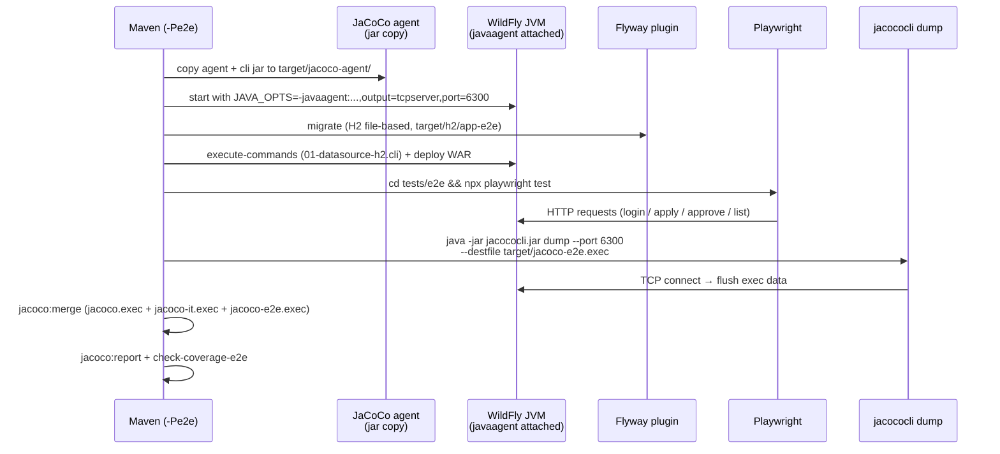
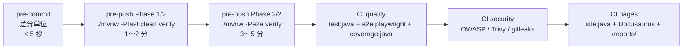

# 技術設計書

仕様書 §2 / §4 / §5 / §6 / §7 / §8 を一本化したリファレンス。実装時はパッケージ位置とコード規約を本ページで確認する。

サンプル例（休暇申請）を含むセクションは `### サンプル例: ...` で明示してあり、適用先プロジェクトでは丸ごと削除してテンプレ部のみ残せばよい（→ [サンプル削除ガイド](./getting-started/strip-sample)）。

## 1. フォルダ構成

### パッケージレイアウト（テンプレ）

```
jp.mufg.it.rcb
├── domain                                 # ドメインモデル / ドメインサービス
│   ├── model                              # エンティティ / 値オブジェクト / enum
│   └── service                            # ドメインサービス
├── application                            # ユースケース層
│   ├── port.in                            # ユースケース IF（@Named 不可）
│   ├── port.out                           # Repository / Clock 等の外部 IF
│   └── service                            # @ApplicationScoped 実装
├── adapter                                # ドライバ / ドリブンアダプタ
│   ├── in.web                             # PrimeFaces バッキングビーン + xhtml
│   └── out.persistence                    # JPA Entity, Repository, Mapper
├── shared
│   ├── config                             # AppConfig（MicroProfile Config ラッパー）
│   ├── security                           # AuthenticationPort + DevLoginAdapter
│   └── web                                # AccessLogFilter, AppUrlBuilder, AuthenticationFilter
├── config                                 # Config / ConfigFactory / ConfigProducer / PropertyId（社内ライブラリ準拠 IF、変更不可）
├── log.cdi                                # @InjectLogger / LoggerProducer / LoggerType（社内ライブラリ準拠 IF、変更不可）
├── log.formatter                          # RcbLogFormatter / RcbMessageResolver / RcbFormatterInstaller（社内ライブラリ準拠 IF、変更不可）
├── exception                              # ExceptionHelper / ErrorCode（社内ライブラリ準拠 IF、変更不可）
│   ├── inner                              # InnerRuntimeException / MSTBusinessException(NonRecover)（社内ライブラリ準拠 IF、変更不可）
│   └── handler                            # FacesExceptionHandler ほか（社内ライブラリ準拠 IF、変更不可）
├── userinfo.dto                           # UserDto / UserPositionDto（社内ライブラリ準拠 IF、変更不可）
└── userinfo.context                       # UserInfoContext（社内ライブラリ準拠 IF、変更不可）
```

#### サンプル例: 休暇申請の追加クラス配置

:::note サンプル例
休暇申請サンプルは上記テンプレに以下のクラスを追加する。適用先プロジェクトでは案件のクラスに置き換える（→ [サンプル削除ガイド](./getting-started/strip-sample)）。
:::

```
domain.model     : LeaveRequest, LeavePeriod, LeaveStatus, LeaveType
domain.service   : ApprovalPolicy
application.port.out : LeaveRepositoryPort, ClockPort
adapter.in.web   : LeaveFormBean, LeaveListBean, LeaveDetailBean (+ leaves/*.xhtml)
adapter.out.persistence : LeaveRequestEntity, LeaveRepositoryAdapter, LeaveRequestMapper
shared.config    : AppConfig#getManagerLayerCodes（部長層コード設定）
```

### 依存方向

```
adapter.in.web  ──┐
                  ├──▶ application.port.in
                  │
adapter.out.persistence ──▶ application.port.out
                                   ▲
                application.service┘──▶ domain
domain は外部依存ゼロ（java 標準 + Lombok のみ）
```

### ArchUnit ルール

| ルール                       | 内容                                                                                                                                                                |
| ---------------------------- | ------------------------------------------------------------------------------------------------------------------------------------------------------------------- |
| Domain Purity                | `..domain..` は `..domain..` / `java..` / `lombok..` 以外に依存しない                                                                                               |
| Application Boundary         | `..application..` は `..adapter..` / `jakarta.persistence..` / `jakarta.faces..` に依存しない                                                                       |
| Adapter Separation           | `..adapter.in..` は `..adapter.out..` に直接依存しない（port 経由必須）                                                                                             |
| Scope Annotation Confinement | `..application..` のクラスは `@Named` / `@ViewScoped` を持たない（`@ApplicationScoped` のみ可）                                                                     |
| Persistence Confinement      | `..domain..` は `jakarta.persistence..` に依存しない                                                                                                                |
| Config Confinement           | アプリ側 4 階層（`..domain..` / `..application..` / `..adapter..` / `..shared..`）は `jp.mufg.it.rcb.config..` に依存しない（社内ライブラリ準拠 IF 内専用）         |
| Log Formatter Confinement    | アプリ側 4 階層（`..domain..` / `..application..` / `..adapter..` / `..shared..`）は `jp.mufg.it.rcb.log.formatter..` に依存しない（Formatter は JUL からのみ参照） |

### 社内ライブラリ準拠 IF パッケージの取り扱い

将来「社内ライブラリ本体」に置き換わる前提の **社内ライブラリ準拠 IF** として配置されたパッケージ群。本ボイラープレート上では独自実装（あるいは社内ライブラリと同等の IF を持つコピー実装）として配置しているが、社内ライブラリ置換時の互換性確保のため **内容変更禁止**（IF・フィールド・メソッド・スコープすべて変更不可）。変更が必要な場合は社内ライブラリチームに相談すること。

| パッケージ                         | 役割                                                                                                                      |
| ---------------------------------- | ------------------------------------------------------------------------------------------------------------------------- |
| `jp.mufg.it.rcb.log.cdi`           | `@InjectLogger` / `LoggerProducer` / `LoggerType`                                                                         |
| `jp.mufg.it.rcb.log.formatter`     | `RcbLogFormatter` / `RcbMessageResolver` / `RcbFormatterInstaller`（messages.properties 解決 + MDC 反映の JUL Formatter） |
| `jp.mufg.it.rcb.exception`         | `ExceptionHelper` / `ErrorCode`                                                                                           |
| `jp.mufg.it.rcb.exception.inner`   | `InnerRuntimeException` 階層 / `MSTBusinessException(NonRecover)`                                                         |
| `jp.mufg.it.rcb.exception.handler` | `FacesExceptionHandler` ほか                                                                                              |
| `jp.mufg.it.rcb.userinfo.dto`      | `UserDto` / `UserPositionDto`                                                                                             |
| `jp.mufg.it.rcb.userinfo.context`  | `UserInfoContext`（セッション保持）                                                                                       |
| `jp.mufg.it.rcb.config`            | `Config` / `ConfigFactory` / `ConfigProducer` / `PropertyId`（社内ライブラリ置換時にパッケージごと差し替わる前提）        |

これらのパッケージから呼び出される独自実装ユーティリティを新規追加する場合も、**呼び出し方向は「社内ライブラリ準拠 IF → 独自実装」の片方向のみ** とし、独自実装側から社内ライブラリ準拠 IF パッケージへの逆参照を増やさないこと。

`userinfo.context.UserInfoContext` は `@SessionScoped` でログイン済みユーザ情報（`UserDto user` フィールドのみ）を保持する Bean。利便メソッドが必要な場合は呼び出し側で `userInfoContext.getUser().getXxx()` を直接展開すること（フィールド追加・メソッド追加・スコープ変更すべて不可）。

#### 改変防止ガード（pre-commit）

`scripts/check-protected-paths.mjs` を `.husky/pre-commit` で実行し、上記 IF パッケージ配下のファイル変更を staged 検出した時点で commit をブロックする。新規 enum 値追加 / メソッド追加 / 新規クラス追加もすべて変更扱い。緊急時は `git commit --no-verify` で迂回可能だが、PR 説明に変更理由を明記すること。

### 設定取得の使い分け

「アプリケーション側設定」と「社内ライブラリ準拠 IF 内部の設定」で取得経路を分離する。

#### アプリ側（`domain` / `application` / `adapter` / `shared`）: `AppConfig`（MicroProfile `@ConfigProperty`）

- アプリで `META-INF/microprofile-config.properties` の値を参照する場合は `shared.config.AppConfig` 経由のみ。
- `AppConfig` 内で `@ConfigProperty(name = "app.xxx")` 経由でフィールド注入し、ドメイン都合に合わせた型変換メソッドを公開する。
- 例（サンプル）: `app.approval.manager-layer-codes` → `AppConfig#getManagerLayerCodes()` → `ApproveLeaveService` / `RejectLeaveService` が CDI inject（休暇申請サンプル用、サンプル削除時は AppConfig からも該当メソッドを削除）。
- 新規アプリ設定は `src/main/resources/META-INF/microprofile-config.properties` にキーを追加し、`AppConfig` にメソッドを追加する（MicroProfile Config 仕様のデフォルト経路。`application.properties` 等の別名を使うと SmallRye Config の自動ロード対象外となり、`@ConfigProperty` が解決できないので注意）。

#### 社内ライブラリ準拠 IF 内専用: `Config` / `@PropertyId` / `ConfigFactory`

- `jp.mufg.it.rcb.config` パッケージは **社内ライブラリ準拠 IF パッケージ内からのみ呼び出し可**（ArchUnit `Config Confinement` で hard gate）。
- アプリ側（`domain` / `application` / `adapter` / `shared`）からの呼び出しは禁止。アプリ側で設定が必要な場合は上記 `AppConfig` を使うこと。
- 社内ライブラリ準拠 IF パッケージ内での利用例:
  - `ExceptionHelper`: `@PropertyId("default") Config` で CDI inject → `default.properties` を参照。
  - `InnerRuntimeException`: CDI inject 不可なため `ConfigFactory.getConfigMap().get("messages")` で静的取得 → `messages.properties` を参照。
- `@PropertyId("xxx")` → `xxx.properties` の素直な対応。`Config` IF は `getMessage(messageId, params...)` / `getInt(key)` の 2 メソッド、未定義キーは空文字 / 0 を返す。
- 新規 `xxx.properties` を追加する場合は `ConfigFactory.buildConfigMap()` に同名キーで登録（未登録キーで Producer 注入を試みると起動時に `IllegalArgumentException`）。
- 現状登録キー: `default`（`default.properties`、`ExceptionHelper` 用 `exceptionhandler.*` キー）/ `messages`（`messages.properties`、`RCB*` / `MST*` 体系のメッセージ ID）。

## 2. データアクセス

### JPA Entity ⇄ Domain 分離

- JPA Entity は `adapter.out.persistence.<Aggregate>Entity`（例: 休暇申請サンプルでは `LeaveRequestEntity`）に配置
- Mapper（例: `LeaveRequestMapper`）が双方向変換
- これにより `..domain..` は `jakarta.persistence..` に依存しない（ArchUnit で hard gate）

### トランザクション境界

- `application.service` のメソッドに `@Transactional`（CDI/JTA）を付与
- バッキングビーンは付与しない（薄く保つため、UseCase 境界がトランザクション境界）

### Flyway 運用

| 種別                 | パス                                              | 用途                                                                           |
| -------------------- | ------------------------------------------------- | ------------------------------------------------------------------------------ |
| バージョン migration | `src/main/resources/db/migration/V<n>__*.sql`     | 本番・開発・E2E 共通（PostgreSQL / H2 両対応の SQL 標準構文）                  |
| 開発・E2E 用シード   | `src/main/resources/db/migration/R__dev_seed.sql` | Flyway repeatable migration として `flyway:migrate` で常に再実行（冪等性確保） |

E2E プロファイル (`-Pe2e`) では `target/h2/app-e2e` の H2 ファイル DB に対して同じ `db/migration` を流す。本番 PostgreSQL / IT / E2E H2 のいずれでも同一ファイル群が走るため、DDL は SQL 標準構文（`BIGINT GENERATED BY DEFAULT AS IDENTITY` 等）に統一している。本番運用で seed を流したくない場合は `R__dev_seed.sql` を除外する Flyway `locations` を別途設定すること。

#### サンプル例: leave_request テーブル定義

:::note サンプル例
休暇申請サンプル（`src/main/resources/db/migration/V1__create_leave_request.sql`）の DDL 例。適用先プロジェクトでは案件の DDL に置き換える（→ [サンプル削除ガイド](./getting-started/strip-sample)）。
:::

```sql
CREATE TABLE leave_request (
  id                  BIGINT       GENERATED BY DEFAULT AS IDENTITY PRIMARY KEY,
  applicant_emp_num   VARCHAR(20)  NOT NULL,
  applicant_name      VARCHAR(100) NOT NULL,
  applicant_org_id    VARCHAR(20)  NOT NULL,
  applicant_org_name  VARCHAR(200) NOT NULL,
  leave_type          VARCHAR(20)  NOT NULL,
  start_date          DATE         NOT NULL,
  end_date            DATE         NOT NULL,
  reason              VARCHAR(500) NOT NULL,
  status              VARCHAR(20)  NOT NULL,
  applied_at          TIMESTAMP    NOT NULL,
  judge_emp_num       VARCHAR(20),
  judge_name          VARCHAR(100),
  judged_at           TIMESTAMP,
  judge_comment       VARCHAR(500),
  CONSTRAINT chk_period CHECK (start_date <= end_date),
  CONSTRAINT chk_judge_complete CHECK (
    (status = 'PENDING' AND judge_emp_num IS NULL AND judged_at IS NULL) OR
    (status IN ('APPROVED','REJECTED') AND judge_emp_num IS NOT NULL AND judged_at IS NOT NULL)
  )
);
```

`chk_judge_complete` は `BR-INV-002` の DB 側最終防壁。

## 3. ロギング

### @InjectLogger 運用

```java
@InjectLogger(LoggerType.SYSTEM)
private Logger sysLogger;       // 業務イベント / 例外

@InjectLogger(LoggerType.ACCESS)
private Logger accessLogger;    // HTTP リクエスト境界
```

`AccessLogFilter`（Servlet Filter）で各リクエストの開始/終了を 1 行記録。

### レベル基準

| レベル | 用途                                                                                                                                          |
| ------ | --------------------------------------------------------------------------------------------------------------------------------------------- |
| ERROR  | システム障害、`MSTBusinessNonRecoverException`（`ExceptionLogHandler` が `Level.SEVERE` で自動出力。デフォルトメッセージ ID は `MST00004-E`） |
| WARN   | 業務イベント上の警告（バリデーション違反、業務ルール上の警告など）。アプリ側コードが明示的に `logger.log(Level.WARNING, ...)` で出力する      |
| INFO   | 正常系の業務イベント（申請/承認/却下/ログイン）                                                                                               |
| FINE   | 開発時のみ                                                                                                                                    |

例外型による自動ログ挙動の違い（`ExceptionLogHandler` 経由）:

- **`MSTBusinessException`（回復可）**: フレームワーク自動ログを **行わない**（`errorLogRequired=false` / `eventLogRequired=false`）。回復可能な業務エラーはユーザへの `FacesMessage` 提示で完結する設計のため、ログノイズを避ける狙い。UseCase 側で必要な場合のみ明示的にログを出す（INFO/WARN）。
- **`MSTBusinessNonRecoverException`（回復不可）**: フレームワークが `Level.SEVERE`（=ERROR）で自動ログ出力する（`errorLogRequired=true` / `eventLogRequired=true`、JSF ライフサイクル経路・Filter 経路の両方で `ExceptionLogHandler#handleErrorLog` が発火）。UseCase 側で **明示 log 呼び出しを行わない**（重複防止）。

### メッセージ ID 採番（テンプレ）

| 範囲                         | 用途                                                                                                                                   |
| ---------------------------- | -------------------------------------------------------------------------------------------------------------------------------------- |
| `RCB00001-I` 〜 `RCB00099-I` | アプリ業務イベント                                                                                                                     |
| `RCB00100-W` 〜 `RCB00199-W` | アプリ業務エラー                                                                                                                       |
| `RCB00001-E` 〜 `RCB00099-E` | システム障害                                                                                                                           |
| `RCB09000-*` 〜 `RCB09999-*` | 認証/共通基盤の拡張枠                                                                                                                  |
| `MST*`                       | 社内ライブラリ準拠 IF（`jp.mufg.it.rcb.exception` 配下）が発火する共通メッセージ。社内ライブラリ置換時は本体側 properties に移管される |

`src/main/resources/messages.properties` が **唯一の正本**。呼び出し側は `logger.log(Level.X, "RCB00001-I", new Object[]{...})` のように **生リテラル文字列** で ID を渡す（PBI #4 規定の IF）。

#### サンプル例: 休暇申請の採番

:::note サンプル例
休暇申請サンプル（leave）で実際に採番している ID 一覧。適用先プロジェクトでは案件のイベント/エラーに置き換える（→ [サンプル削除ガイド](./getting-started/strip-sample)）。
:::

| ID           | 種別 | 発火                              |
| ------------ | ---- | --------------------------------- |
| `RCB00001-I` | INFO | 申請受付成功                      |
| `RCB00002-I` | INFO | 承認成功                          |
| `RCB00003-I` | INFO | 却下成功                          |
| `RCB00101-W` | WARN | 開始日 > 終了日（バリデーション） |

認証・共通基盤側（サンプル削除後も残る）の主要 ID：

| ID           | 種別  | 発火            |
| ------------ | ----- | --------------- |
| `RCB00004-I` | INFO  | ログイン成功    |
| `RCB00005-I` | INFO  | ログアウト      |
| `RCB00001-E` | ERROR | DB アクセス失敗 |
| `RCB09001-W` | WARN  | 未認証アクセス  |

### メッセージ解決機構（`log.formatter`）

`jp.mufg.it.rcb.log.formatter.RcbLogFormatter`（社内ライブラリ準拠 IF）が JUL の `Formatter` として登録され、`LogRecord` に渡されたメッセージ ID を `messages.properties` 経由でテンプレート解決＋`MessageFormat` でパラメータ展開する。

- `RcbFormatterInstaller`（`@ApplicationScoped` Bean）が `@Observes @Initialized(ApplicationScoped.class)` のフックでアプリ起動時に root logger 配下の全 Handler の Formatter を差し替える。これにより WildFly subsystem=logging の ConsoleHandler も `RcbLogFormatter` に差し変わる。
- 未解決 ID（`messages.properties` に未登録）は **元キーをそのまま出力（fail-open）** し、`System.err` に「`[RcbLogFormatter] unresolved messageId=<key>`」を **同一キー初回のみ** 出す（無限再帰防止のため Formatter から JUL Logger は呼ばない）。
- `RCB` / `MST` で始まらない文字列はメッセージ ID 解決を行わず素通し（FINE 以下用の生メッセージや、`AccessLogFilter` の `String.format` 整形済み文字列向け）。
- 出力フォーマット: `yyyy-MM-dd'T'HH:mm:ss.SSS LEVEL [loggerName] [requestId][empNum] message[\nstackTrace]`（WildFly pattern と等価、JUL の `WARNING` は `WARN` にマップ）。

### MDC

`AccessLogFilter` で `requestId`（UUID 短縮）と `empNum` を MDC 格納、レスポンス完了時に `MDC.remove`。`RcbLogFormatter` が `org.jboss.logging.MDC.get(...)` で MDC を取得して `[requestId][empNum]` 形式で出力に含める（未設定時はプレースホルダ `-`）。`logging.properties` 側のフォーマット指定（旧 `SimpleFormatter.format`）は不要となり削除済み。

## 4. エラーハンドリング

### 例外スローの基本方針

**本アプリでアプリ側コード（UseCase / バッキングビーン / ドメインサービス）から例外を throw する場合は、原則として `MSTBusinessException`（回復可）または `MSTBusinessNonRecoverException`（回復不可）を利用する。** 社内ライブラリ準拠 IF（`jp.mufg.it.rcb.exception.inner`）が `FacesExceptionHandler` 経由の一括処理パスに乗るのはこの 2 つの例外型 + その派生に限るため、アプリ側で独自例外を作って横道に逸らさない。

使い分けの目安:

- **`MSTBusinessException`（回復可）**: ユーザ操作で回復可能な業務エラー（入力バリデーション違反、権限不足、状態不整合、対象データ不存在など）。デフォルトでは現画面に `FacesMessage(SEVERITY_ERROR)` を表示して留置、`setRedirectPage(...)` で別画面遷移にも切替可能。フレームワーク自動ログは行わない。
- **`MSTBusinessNonRecoverException`（回復不可）**: 業務処理が継続不可能なエラー（永続化失敗、外部システム不整合、想定外の状態遷移など）。`/error.xhtml` 遷移 + `Level.SEVERE` 自動ログ（`MST00004-E`）。

例外的に上記 2 つで表現できないシステム例外（永続層・外部 I/O から自然に投げられる `RuntimeException` 等）は無理にラップせず、そのまま伝搬させる（`FacesExceptionHandler` の unknown 経路 → web.xml `<error-page>` で `/error.xhtml` 着地）。新規例外型が必要な場合は社内ライブラリチームと相談する（アプリ側に独自例外クラスを新設しない）。

### 設計原則

業務エラー / システムエラーは社内ライブラリ準拠 IF パッケージ（`exception.handler` 配下）の `FacesExceptionHandler` → `ExceptionFacesResponseHandler` が JSF ライフサイクル内で **一括処理する**。アプリ側コード（UseCase / バッキングビーン）は例外を **throw するのみ** で、catch しない。

```
UseCase / ドメイン層
  └─ throw new MSTBusinessException("業務メッセージ")
        │
        ▼
JSF ライフサイクル（action 呼び出しから戻る経路）
  └─ FacesExceptionHandler#handle()
        │
        ▼
ExceptionFacesResponseHandler#handleErrorResponse()
  ├─ MSTBusinessException(setRedirectPage 設定済) → 指定画面に redirect
  ├─ httpstatus=400  → 同一画面に FacesMessage(SEVERITY_ERROR) を追加（留置）
  ├─ httpstatus=4xx/5xx → faces-config.xml の error.page.{status} に redirect
  └─ InnerRuntimeException ではない → /error.xhtml（unknown 経由）
```

`MSTBusinessException` のデフォルト ErrorCode は `INVALID_OPERATION`、対応する HTTP ステータスは `default.properties` の `exceptionhandler.invalid-operation.httpstatus=400` で 400 に設定済み。したがって `new MSTBusinessException("メッセージ")` を throw すれば「現画面留置 + エラーメッセージ表示」になる。

### 例外型と着地

| 例外型                                        | 経路                                                            | 着地                                      |
| --------------------------------------------- | --------------------------------------------------------------- | ----------------------------------------- |
| `MSTBusinessException`（回復可、HTTP 400）    | `ExceptionFacesResponseHandler#handleKnownException`            | 同じ画面に FacesMessage（SEVERITY_ERROR） |
| `MSTBusinessException`（redirectPage 設定済） | 同上                                                            | `setRedirectPage(...)` で指定した画面     |
| `MSTBusinessNonRecoverException`（回復不可）  | `web.xml` `<error-page>`（JSF ライフサイクル外含む）            | `/error.xhtml`                            |
| `ApplicationSessionInvalidException`          | `FacesExceptionHandler#handle`（`ViewExpiredException` ラップ） | `error.page.<status>` 設定先              |
| その他システム例外                            | `ExceptionFacesResponseHandler#handleUnknownException`          | `/error.xhtml`（500 リダイレクト）        |

### 業務エラーの表現ポリシー

- **`ErrorCode` enum を独自拡張しない**。社内ライブラリで定義済みの enum であり、変更禁止（pre-commit ガードで検出）。`AGENTS.md` §「社内ライブラリ準拠 IF パッケージ」参照。
- **業務固有のメッセージ文言は `MSTBusinessException` のコンストラクタ引数（`errorMessageParams`）で渡す**。`default.properties` の `exceptionhandler.invalid-operation.message={0}` が `{0}` passthrough テンプレートで、第 1 引数がそのままユーザに表示される。
- **別の標準 ErrorCode に切り替えたい場合** は `.overrideErrorCode(ErrorCode.XXX)` を使う。新規切り替え時は `default.properties` に `exceptionhandler.{errorCode}.message` と `.httpstatus` を追加する。
- **`messages.properties` との使い分け**：`messages.properties` は JUL ロガー（`RcbLogFormatter`）経由のログ出力用。ユーザ向け応答メッセージは `default.properties` の `exceptionhandler.*` 配下に集約する（経路が別）。

#### サンプル例: 業務エラーメッセージの渡し方

:::note サンプル例
休暇申請サンプル（`ApproveLeaveService` 等）で `MSTBusinessException` に業務メッセージを渡している例。適用先プロジェクトでは案件のエンティティ名・条件に置き換える（→ [サンプル削除ガイド](./getting-started/strip-sample)）。
:::

```java
// 対象データ不存在
throw new MSTBusinessException("指定された休暇申請が存在しません（id=" + id + "）");

// 状態不整合
throw new MSTBusinessException("申請中の休暇申請のみ承認/却下できます");

// 権限不足
throw new MSTBusinessException("この休暇申請を承認/却下する権限がありません");
```

### catch 規約

- **バッキングビーンで `MSTBusinessException` / `MSTBusinessNonRecoverException` を try-catch しない**。`ExceptionFacesResponseHandler` が一括処理するため重複となる。`return null` も不要（例外時は JSF が action navigation を実行せず現画面に留まる）。
- **やむを得ず catch する場合** は「例外内容に応じて複数 UI フィールドの状態を再構築する」など、ハンドラ任せにできない明確な理由が必要。catch ブロック先頭に理由コメントを必須とする。
- **`Exception` / `RuntimeException` の catch-all は禁止**（必要なら個別例外型を指定）。
- **UseCase / ドメイン層は catch せず throw のみ**。トランザクション境界（`@Transactional`）でロールバックが必要なため。

## 5. バリデーション

### 層別責務

| 層                            | 役割                                                             | 失敗時                                                  |
| ----------------------------- | ---------------------------------------------------------------- | ------------------------------------------------------- |
| xhtml                         | UI 必須マーカー、日付ピッカー型制御                              | フォームに即時表示                                      |
| JSF コンバータ/バリデータ     | 即時的な型・長さ検査                                             | `FacesContext` 経由 `p:messages`                        |
| **Bean Validation（正本）**   | 必須・長さ・enum・日付関係（`@AssertTrue`）                      | `ConstraintViolationException` → バッキングビーン catch |
| ドメイン値オブジェクト        | 不変条件の再評価                                                 | 到達したら設計バグ                                      |
| **UseCase（業務ルール正本）** | 状態整合性、権限・所属、ドメイン不変条件など案件固有の業務ルール | `MSTBusinessException`                                  |
| DB CHECK                      | 最終防壁                                                         | 到達してはいけない                                      |

### 二重弾き

「構造的検証は Bean Validation の Command DTO に集約」「業務ルールは UseCase が正本」が原則。CDI Interceptor で UseCase 入口も `@Valid` 経由で二重弾き。

#### サンプル例: 休暇申請の業務ルール検証

:::note サンプル例
休暇申請サンプル（`ApplyLeaveCommand` / `ApproveLeaveService` 等）で UseCase 側が正本として実装している業務ルール。適用先プロジェクトでは案件固有のルールに置き換える（→ [サンプル削除ガイド](./getting-started/strip-sample)）。
:::

| 検証内容                                          | 実装位置                                                                   |
| ------------------------------------------------- | -------------------------------------------------------------------------- |
| 開始日 ≤ 終了日（BR-INV-001）                     | `ApplyLeaveCommand#isValidPeriod()`（`@AssertTrue` で Bean Validation 段） |
| `PENDING` のみ承認/却下可能                       | `ApproveLeaveService` / `RejectLeaveService`（status 整合性チェック）      |
| 自分が申請した休暇は承認/却下不可（自己承認禁止） | 同上（`UserInfoContext` の `empNum` と申請者 `empNum` を比較）             |
| 承認者の所属＋職層が承認権限を満たすこと          | 同上（`ApprovalPolicy.canApprove` を再評価 — §6 認可 サンプル例も参照）    |

## 6. 認証 / 認可

### 認証

- `AuthenticationFilter`（`@WebFilter("/*")`）がセッション内 `UserInfoContext.getUser()` の非 null を確認
- 未認証なら `/login.xhtml` へリダイレクト
  - skipPaths: `/login.xhtml` / `jakarta.faces.resource` / `resources` / `/error.xhtml`
- **`AuthenticationPort`** を抽象化し、Adapter を差し替え可能に
  - 開発用：`DevLoginAuthenticationAdapter`（`dev-users.yml` 由来のダミーユーザを `LoginBean`／`login.xhtml` から選択して `UserInfoContext` に格納する補助 UI 一式。開発時のみ使用）
  - 将来：`HeaderAuthenticationAdapter`（社内認証サーバ経由のリクエストヘッダ `X-User-Id` から `UserDto` を組み立て、ログイン画面は消える）
- 切替は CDI `@Alternative` または環境変数 `APP_AUTH_MODE` ベースの選択

### 認可

URL ベースの role mapping はやらず、業務ロジック側（UseCase）に集約する。基本フロー:

1. UseCase が対象データを取得し、存在チェック
2. 前提条件チェック（status / version などの状態整合性）
3. アクター（操作者）の権限・所属を評価
4. 違反は `MSTBusinessException`（回復可）を throw

#### 権限評価の足回り

- `UserInfoContext`（`@SessionScoped`）からセッション格納の `UserDto` を取得する。
- `UserDto#getMainUserPositionDto()` で主務の `UserPositionDto` を取り、`orgId` / `layerSCode` / `pstnCode` 等で判定する。
- 認証が未済なら `AuthenticationFilter` が `/login.xhtml` リダイレクトするため、UseCase に到達した時点で `getUser()` は非 null（防御コードは不要）。

画面側の `rendered="#{xxxBean.canDoX}"` は **UX 上のボタン抑制目的のみ**。URL 直叩きや POST 偽装でも UseCase 側で必ず再評価するため突破不能（DTO に事前計算したフラグを bind するパターンを推奨：算出を UseCase に一本化でき、画面側にロジックを漏らさない）。

#### サンプル例: 休暇申請の認可ロジック（BR-POL-002 関連）

:::note サンプル例
休暇申請サンプル用の認可一式（承認権限ヘルパ・自己承認禁止・DTO bind フラグ・部長層コード設定）。適用先プロジェクトで承認ワークフローの概念がない場合は、本セクションで挙げているクラス／プロパティをまとめて削除する（→ [サンプル削除ガイド](./getting-started/strip-sample)）。承認系の業務がある案件であれば、`ApprovalPolicy` を起点に流用可能（leave 固有知識は持たない）。
:::

**承認権限ヘルパ — `domain.service.ApprovalPolicy`**

申請者所属 vs 承認者所属＋職層コードを評価する汎用ヘルパ。シグネチャ:

```java
boolean canApprove(String applicantOrgId,
                   String approverOrgId,
                   String approverLayerSCode,
                   Set<String> managerLayerCodes)
```

判定式は `applicantOrgId.equals(approverOrgId) && managerLayerCodes.contains(approverLayerSCode)`。承認概念がない案件ではクラスごと削除。

**呼び出し例 — `ApproveLeaveService` / `RejectLeaveService`**

```java
// 1. 対象取得 + 存在チェック → MSTBusinessException("指定された休暇申請が存在しません...")
// 2. status 整合性（PENDING のみ）→ MSTBusinessException("申請中の休暇申請のみ...")
// 3. 自己承認禁止：req.getApplicantEmpNum().equals(user.getEmpNum()) なら拒否
// 4. ApprovalPolicy.canApprove 再評価：違反なら MSTBusinessException("...権限がありません")
```

**画面側の rendered ガード — `LeaveRequestDetail#canApprove` / `canReject`**

UseCase で算出済みのフラグを `FindLeaveService` が DTO `LeaveRequestDetail` に bind し、`detail.xhtml` 側は `rendered="#{leaveDetailBean.detail.canApprove or leaveDetailBean.detail.canReject}"` でボタン表示を制御する（あくまで UX 目的、突破時は UseCase 側 `ApproveLeaveService` / `RejectLeaveService` で再評価される）。

**設定 — 部長層コード**

`META-INF/microprofile-config.properties`:

```
app.approval.manager-layer-codes=M1,M2
```

`@ConfigProperty` 経由で `AppConfig#getManagerLayerCodes()` が `Set<String>` を返し、`ApprovalPolicy.canApprove` に渡す。承認概念がない案件では本プロパティと `AppConfig#getManagerLayerCodes()` メソッドを削除。

## 7. URL / コンテキストルート規約

junction-path 対応：

- アプリのコンテキストルートは `/rcb` で固定（`jboss-web.xml` で `${env.APP_CONTEXT_ROOT:/rcb}`）
- WildFly の Undertow に `proxy-address-forwarding=true` を CLI で設定（`04-proxy-forwarding.cli`）
- **絶対パス（先頭スラッシュ付きリンク）禁止**
- `<h:link>` / `<h:button>` / `<h:outputStylesheet>` 等の JSF コンポーネントを必須利用
- 生 `<a>` が必要なら `#{request.contextPath}/…`
- 絶対 URL が必要な場合（メール本文等）は `shared.web.AppUrlBuilder` に集約、`APP_EXTERNAL_BASE_URL` で上書き可能

詳細は ADR-003。

## 8. テスト戦略

### 8.1 テスト戦略概要

- **ドメイン / アプリケーション層は単体テストで担保**（port をモックして純粋ロジックを高速検証）。
- **アダプタ層（Repository + Backing Bean）は結合テストで担保**。**バッキングビーンの単体テスト（Service モック）は行わない**（mock を多用したテストは本番経路を保証しないため）。バッキングビーン IT は本物の Service / 本物の `LeaveRepositoryAdapter` / 本物の H2 DB まで通し、`FacesContext` のみ `Mockito.mockStatic` で差し替える。
- **CDI 配線の正しさ / `@Transactional` / JSF ライフサイクル / Servlet Filter 経路**は WildFly 起動の Playwright E2E が担保する（結合テスト側はコンテナを起動しないので、Bean IT は手動配線 + リフレクション注入で組み立てる）。
- **E2E カバレッジは JaCoCo に統合する**: `-Pe2e` プロファイル時に WildFly JVM へ JaCoCo agent (`output=tcpserver`) を attach し、Playwright 終了後に `jacococli dump` で `target/jacoco-e2e.exec` を採取。`jacoco-merged.exec` に unit + IT + E2E を統合した上で、基本 95% 閾値の hard gate を再評価する。
- 結合テスト基盤は `jp.mufg.it.rcb.shared.test.JpaTestSupport`（H2 bootstrap / `@PersistenceContext` リフレクション注入 / TX ヘルパ）と `ReflectionTestSupport` に共通化。新規 Repository Adapter が増えても per-adapter Support クラスを作る必要はない。
- 性能テスト（k6）は smoke 1 シナリオを `tests/perf/` に配置。CI / pre-push では走らせず、nightly / 手動で実行。

設計原則:

| 原則                              | 理由                                                                                                                                                                   |
| --------------------------------- | ---------------------------------------------------------------------------------------------------------------------------------------------------------------------- |
| mock を多用したテストは書かない   | 本番経路を保証しない。Repository / Backing Bean は H2 + 本物 Service まで通す                                                                                          |
| per-adapter の Support は作らない | 共通の `JpaTestSupport` で `@PersistenceContext` リフレクション注入 / TX ヘルパを再利用                                                                                |
| 速度 vs 配線正当性 vs 性能        | 単体 = 速度（< 5 秒）/ 結合 = ロジック網羅 / E2E = 配線正当性 / 性能 = 限界探索。混在させない                                                                          |
| 社内ライブラリ準拠 IF は責任分離  | `jp.mufg.it.rcb.{log.cdi,log.formatter,exception.**,userinfo.**,config}` は変更禁止。独自実装側（`domain.*` / `application.*` / `adapter.*` / `shared.*`）と分けて評価 |

### 8.2 テストピラミッド

```mermaid
graph TB
    classDef unit fill:#cfe7ff,stroke:#1e6bb8;
    classDef arch fill:#e0d7ff,stroke:#5b3fbf;
    classDef it fill:#d0f0c0,stroke:#3e8e41;
    classDef e2e fill:#ffd9b3,stroke:#cc7a00;
    classDef perf fill:#ffcccc,stroke:#cc0000;

    U[ "単体 (Surefire) <br/>約 20 ケース<br/>&lt; 5 秒<br/>純粋ロジック網羅" ]:::unit
    A[ "ArchUnit (Surefire 内) <br/>1 クラス 5 ルール<br/>&lt; 5 秒<br/>層境界 hard gate" ]:::arch
    I[ "結合 (Failsafe) <br/>約 6 ケース (Bean IT 4 + Repo IT 1 + 自由枠)<br/>&lt; 30 秒<br/>H2 + 本物 Service" ]:::it
    E[ "E2E (Playwright) <br/>3 シナリオ (golden + 認可 + 自己承認禁止)<br/>約 1〜2 分<br/>CDI / JSF / Filter 配線担保" ]:::e2e
    P[ "性能 (k6) <br/>1 スモーク<br/>30 秒<br/>limit 探索 (nightly)" ]:::perf

    U --> A
    A --> I
    I --> E
    E --> P
```

下層ほど件数が多く高速、上層ほど件数を絞って配線/限界を検証する典型的なテストピラミッド。

### 8.3 層別テスト責務マトリクス

各層 × 各カテゴリで「◎ = 主担当 / ○ = 補助 / ― = 対象外」と「何を保証するか」を併記する。

| 層                                                                                              | 単体 (Surefire)                            | 結合 (Failsafe)                                                  | E2E (Playwright)                     | 性能 (k6)           |
| ----------------------------------------------------------------------------------------------- | ------------------------------------------ | ---------------------------------------------------------------- | ------------------------------------ | ------------------- |
| `..domain..`                                                                                    | ◎ ドメインロジック / 不変条件              | ―                                                                | ―                                    | ―                   |
| `..application..`                                                                               | ◎ UseCase ロジック / port mock             | ○ Bean IT 経由で受動的に通過                                     | ○ E2E が UseCase を実通過            | ―                   |
| `..adapter.in.web..`                                                                            | ― (mock 単体禁止)                          | ◎ Bean IT で `@PostConstruct` / submit / action を本物経路で検証 | ◎ JSF ライフサイクル / postback 経路 | ―                   |
| `..adapter.out.persistence..`                                                                   | ―                                          | ◎ Repository IT で H2 経由の永続化                               | ○ E2E が Repository を実通過         | ―                   |
| `..shared.config..`                                                                             | ◎ MicroProfile Config ラッパー単体         | ○                                                                | ○                                    | ―                   |
| `..shared.security..`                                                                           | ◎ dev-users.yml ローダ単体                 | ○ Bean IT (LoginBean) で経路通過                                 | ◎ ログイン～セッション生成           | ―                   |
| `..shared.web..` (Filter / AppUrlBuilder)                                                       | ○ 単体可能な経路 (外部公開 URL 設定済み等) | ―                                                                | ◎ Filter / FacesContext 経由         | ―                   |
| 社内ライブラリ準拠 IF (`config` / `log.cdi` / `log.formatter` / `exception.**` / `userinfo.**`) | ― (カバレッジ計測対象外)                   | ―                                                                | ―                                    | ―                   |
| 全アプリ                                                                                        | ―                                          | ―                                                                | ―                                    | ◎ 一覧 GET スモーク |

### 8.4 カバレッジ閾値

JaCoCo の閾値は **本体（`-Pfast` / `-Pci-mr` / `-Pci-main`）** と **`-Pe2e`** の 2 系統 × フラット閾値で運用する。アプリ側パッケージ全体を `element=BUNDLE` 1 本でフラット評価する。

| 系統    | LINE | BRANCH | 達成手段                     |
| ------- | ---- | ------ | ---------------------------- |
| 本体    | 85%  | 85%    | 単体テスト + 結合テスト      |
| `-Pe2e` | 95%  | 95%    | 単体 + 結合 + E2E カバレッジ |

社内ライブラリ準拠 IF パッケージ（`config` / `log.cdi` / `log.formatter` / `exception.**` / `userinfo.**`）は内容変更不可・将来差し替え予定のため、独自実装と責任分離していずれの系統でも plugin-level `<excludes>` で対象外。HTML レポートにも出力しない。

クラス単位の例外（コンテナ依存などで達成不能なもの）は ADR-004 の例外台帳で管理する。追加手順は ADR-004 と `rules/README.md` §4.5 を参照。

### 8.5 E2E カバレッジ計測戦略



- **agent attach パラメータ**: `output=tcpserver, address=*, port=6300, append=false`（agent 側では `includes` を指定せず全クラスを計装。集計時の絞り込みは `pom.xml` jacoco-maven-plugin `<excludes>` に一元化されており、社内ライブラリ準拠 IF パッケージ（`config` / `log.cdi` / `log.formatter` / `exception` / `userinfo`）のみが除外される）。
- **`AUTO_SERVER=TRUE`** を H2 URL に付けることで Maven Flyway plugin（別 JVM）と WildFly（別 JVM）が同一 H2 ファイルへ同時接続できる。
- **失敗時のフォールバック**: `scripts/jacoco-dump-wait.sh` が TCP 接続を 30 秒 retry。dump が失敗した場合は WARN + `jacoco-e2e.exec` を 0 byte で touch して、後段の merge が自動で除外する設計（CI ジョブは fail させない）。
- **Pages 公開**: `target/site/jacoco/index.html` は `e2e:playwright` ジョブ由来の「単体 + 結合 + E2E」統合レポートを公開する（`pages` ジョブが `e2e:playwright` artifact を取り込む）。Playwright HTML レポートは `/reports/playwright/` に追加公開。

### 8.6 結合テスト基盤

#### `JpaTestSupport`

| API                                         | 役割                                                                                                                         |
| ------------------------------------------- | ---------------------------------------------------------------------------------------------------------------------------- |
| `bootstrapH2(puName, jdbcUrl, ddlPaths...)` | H2 にスキーマを作成し `EntityManagerFactory` を生成。DDL は classpath 上の絶対パスを指定（`/db/migration/V1__*.sql`）        |
| `injectEntityManager(adapter, em)`          | `@PersistenceContext` 注釈付きフィールドへリフレクションで EM を注入。新規 Repository Adapter が増えても本メソッドで流用可能 |
| `runInTx(em, action)`                       | `EntityTransaction` 境界での実行ヘルパ。失敗時は rollback して再 throw                                                       |

#### `ReflectionTestSupport`

- `injectField(target, fieldName, value)` で `@InjectLogger` などのフィールドをテストで差し替える

#### バッキングビーン IT パターン集

代表クラス列はサンプル例（休暇申請）の参考。適用先プロジェクトでは自案件のクラスに置き換える。

| パターン             | 代表クラス（サンプル）          | 構成要素                                                                                               |
| -------------------- | ------------------------------- | ------------------------------------------------------------------------------------------------------ |
| リスト取得型         | `LeaveListBeanIT`（サンプル）   | `@PostConstruct init()` 相当を IT 内で呼び、seed 済データを read。`FacesContext` static mock のみ      |
| 状態遷移型           | `LeaveDetailBeanIT`（サンプル） | `runInTx` でアクション境界を作り、approve / reject 後の status を assert                               |
| コマンド型           | `LeaveFormBeanIT`（サンプル）   | submit → `em.clear()` → 検索 で永続化結果を確認。Bean Validation 経路は本番 Adapter 側で `@Valid` 起動 |
| 認証ライフサイクル型 | `LoginBeanIT`（共通基盤）       | `UserInfoContext.setUser(...)` → `getUser()` → `setUser(null)` の遷移を本物の Bean で踏む              |

各パターン共通の注意点:

- `FacesContext` の static mock は `Mockito.mockStatic(FacesContext.class)` を `@BeforeEach` で開始し `@AfterEach` で必ず close。close 漏れは他テストへ波及するので順序保証必須。
- `em.clear()` は「永続化が成功した結果を改めて検索で読み取る」テストで必須（同一 EM の 1 次キャッシュを通すと永続化前のオブジェクトが返るため）。
- 複数 Service を注入する場合は「Repository → Service → Bean」の順で build し、`@InjectLogger` フィールドのみ `ReflectionTestSupport.injectField` で差し替える。

### 8.7 CI フェーズ分割



| 段               | 内容                                                                                                                             | hard gate                                                         | 所要時間目安 |
| ---------------- | -------------------------------------------------------------------------------------------------------------------------------- | ----------------------------------------------------------------- | ------------ |
| pre-commit       | 差分単位の Spotless / Checkstyle (google + blocking) / PMD / 保護パスガード                                                      | 上記すべて                                                        | < 5 秒       |
| pre-push Phase 1 | 全体 Lint（ESLint / Prettier / Checkstyle / PMD / SpotBugs）+ ArchUnit + Surefire + Failsafe + JaCoCo 本体閾値                   | 全静的解析 / 単体 + 結合テスト / JaCoCo 本体閾値（excludes 付き） | 1〜2 分      |
| pre-push Phase 2 | WildFly + H2 起動 → Flyway migrate → CLI 適用 → deploy → Playwright → JaCoCo dump → merge → check-coverage-e2e (LINE/BRANCH 95%) | E2E シナリオ全件 / 統合 JaCoCo 95%                                | 3〜5 分      |
| CI quality       | pre-push と同等。`test:java` (本体 verify) + `e2e:playwright` (e2e プロファイル) + `coverage:java` (merge 済み exec の再 check)  | 上記すべて                                                        | 5〜8 分      |
| CI security      | OWASP DC (CVSS≥7) + Trivy (fs / image) + gitleaks                                                                                | CVE / secret 検出ゼロ                                             | 並列実行     |
| CI pages         | `mvn site` + Docusaurus build + `public/reports/` 合成（jacoco 統合レポート + Playwright HTML）                                  | main / jakartaEE ブランチのみ                                     | -            |

#### `HUSKY_E2E_SKIP` の運用

AI 主導開発で短サイクル（数分単位の push）を回す場合、pre-push Phase 2 が重いため `HUSKY_E2E_SKIP=1` で skip 可能としている。ただし以下を厳守:

- skip した場合は **AI は明示的にユーザに告知する**（暗黙の skip は禁止）
- **push 前の最終確認では Phase 2 を必ず実行**（CI で初めて落ちる事態を避ける）
- skip 後の push でも CI 側 `e2e:playwright` は走るため、最終 hard gate は CI 側にもある

### 8.8 テスト実行コマンド一覧

| 目的                                       | コマンド                                                              |
| ------------------------------------------ | --------------------------------------------------------------------- |
| 単体のみ                                   | `./mvnw -Pfast test`                                                  |
| 単体 + 結合（pre-push Phase 1 相当）       | `./mvnw -Pfast clean verify`                                          |
| 単体 + 結合 + E2E（pre-push Phase 2 相当） | `./mvnw -Pe2e verify`                                                 |
| カバレッジ閾値チェック（CI と同じ）        | `./mvnw -Pci-mr jacoco:report jacoco:check`                           |
| レポート HTML 確認                         | `open target/site/jacoco/index.html` / `tests/e2e/playwright-report/` |
| 性能スモーク                               | `k6 run tests/perf/smoke.js`                                          |
